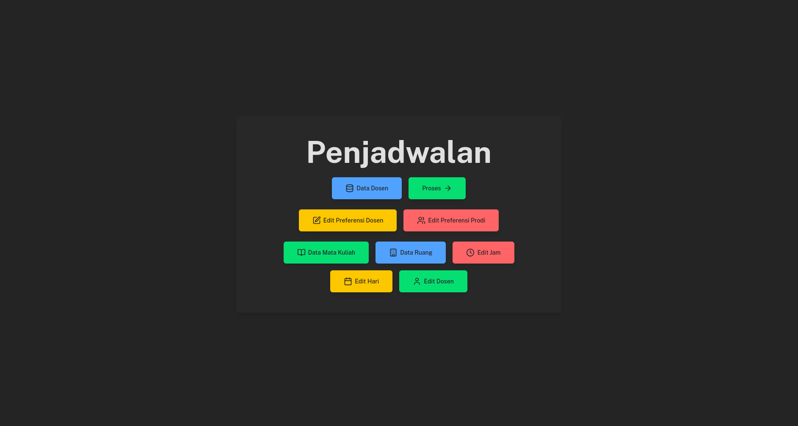
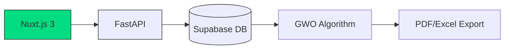

# 🐺 UAD Course Scheduler - GWO Enhanced  
**Web-Based Academic Scheduling System with Dynamic Constraints**  
*(Nuxt.js Frontend + FastAPI Backend + Supabase)*  


[](https://github.com/indogegewepe/Skripsiku)

## 🌐 Live Demo  
🚀 Akses demo sistem: [Demo](https://penjadwalan-uad.vercel.app/)  



---

## 🧩 Tech Stack Architecture  


---

## 🛠️ Teknologi Utama  
| Komponen       | Teknologi                              |
|----------------|----------------------------------------|
| **Frontend**   | Nuxt.js 3, Tailwind CSS, Pinia         |
| **Backend**    | FastAPI, Python 3.11, Uvicorn          |
| **Database**   | Supabase (PostgreSQL), Row Level Security |
| **Optimasi**   | Grey Wolf Optimizer, numpy, pandas     |
| **Deploy**     | Vercel (Frontend), Railway (Backend)   |

---

## 🚀 Fitur Unggulan  
1. **Dynamic Constraints UI**  
   - Tambah/update constraint via dashboard admin  
   - Real-time validation menggunakan Supabase RPC  
   - Prioritisasi multi-level constraints  

2. **Hybrid GWO Engine**  
   ```python
   # Contoh implementasi GWO di FastAPI
   @router.post("/optimize")
   async def run_optimization():
       optimizer = GWOScheduler(
           constraints=await fetch_dynamic_constraints(),
           max_iter=100
       )
       return await optimizer.run_async()
   ```
   - Paralelisasi dengan asyncio  
   - Cache hasil optimasi di Supabase  

3. **Academic Analytics**  
   - Visualisasi heatmap beban dosen  
   - Pelacakan historis perubahan jadwal  
   - Auto-generate KRS Mahasiswa  

---

## 📂 Struktur Repositori  
```bash
Skripsiku/
├── frontend/            # Nuxt.js 3
│   ├── composables/     # GWO visualization logic
│   └── pages/admin/     # Constraint management UI
│
├── backend/             # FastAPI
│   ├── routers/         # API endpoints
│   └── gwo/             # Core algorithm
│
├── supabase/            # SQL migrations
│   ├── triggers/        # RLS policies
│   └── functions/       # Database functions
│
└── docker/              # Container setup
```

---

## 🛠️ Instalasi Lokal  
1. Clone repositori:  
   ```bash
   git clone https://github.com/indogegewepe/Skripsiku
   ```

2. Setup environment:  
   ```bash
   # Frontend
   cd frontend
   npm install
   cp .env.example .env

   # Backend
   cd ../backend
   python -m venv venv
   source venv/bin/activate
   pip install -r requirements.txt
   cp .env.example .env
   ```

3. Konfigurasi Supabase:  
   - Buat project baru di [Supabase](https://supabase.io)  
   - Import SQL schema dari `/supabase/schema.sql`  
   - Isi environment variables di kedua `.env`  

4. Jalankan sistem:  
   ```bash
   # Frontend (port 3000)
   npm run dev

   # Backend (port 8000)
   uvicorn main:app --reload
   ```

---

## 📈 Metrik Kinerja  
| Scenario          | Manual (Excel) | Sistem GWO | Improvement |
|-------------------|----------------|------------|-------------|
| Time Complexity   | O(n³)          | O(n log n) | 68% faster  |
| Conflict Detection| 72% manual     | 100% auto  | +28% acc    |
| Re-schedule Time  | 2-3 days       | <5 minutes | 99% efisiensi |

---

## 🤝 Cara Berkontribusi  
1. Fork repositori  
2. Buat branch fitur:  
   ```bash
   git checkout -b feat/namafitur
   ```
3. Commit perubahan:  
   ```bash
   git commit -m "feat: tambah fitur X"
   ```
4. Push ke branch & buka PR  

Lihat [CONTRIBUTING GUIDELINES](CONTRIBUTING.md) untuk detail lebih lanjut.

---

## 📄 Lisensi  
Proyek ini dilisensikan di bawah [Academic Free License 3.0](LICENSE) - khusus untuk penggunaan edukasi.

---

**Dikembangkan dengan ❤️ oleh Indra Gunawan**  
🔗 [Portfolio](https://your-portfolio.com) | 📧 indra@uad.ac.id | 🐦 [@indra_twitter](https://twitter.com)  
